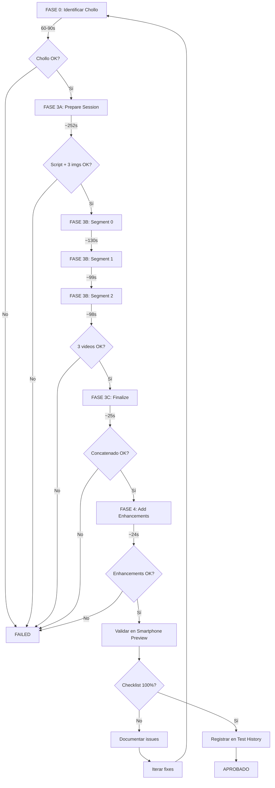

# Checklist de Validación E2E - Workflow Nano Banana → VEO3

Este documento describe el proceso completo de validación para cada video
generado a través del workflow E2E.

## 📋 Pre-requisitos

- ✅ Servidor corriendo: `npm run dev`
- ✅ Créditos VEO3 disponibles (mínimo $0.90 por video completo)
- ✅ Conexión a Supabase (para almacenar imágenes Nano Banana)

## 🎬 Fases de Generación E2E

### FASE 0: Identificar Chollo

**Endpoint**: `GET /api/bargains/top`

- **Duración esperada**: 60-90s
- **Timeout**: 120s
- **Validación**:
    - [ ] Respuesta 200 OK
    - [ ] `data.length > 0`
    - [ ] Top bargain tiene `valueRatio > 1.2`
    - [ ] Player data completa (name, team, stats, price)

### FASE 3A: Preparar Sesión (Script + Nano Banana)

**Endpoint**: `POST /api/veo3/prepare-session`

- **Duración esperada**: 240-270s (~4.2 min)
- **Timeout**: 600s (10 min)
- **Validación**:
    - [ ] Status: `"prepared"`
    - [ ] Script generado con 3 segmentos
    - [ ] 3 imágenes Nano Banana contextualizadas:
        - [ ] Intro: Close-Up (shoulders up)
        - [ ] Middle: Medium Shot (waist up)
        - [ ] Outro: Medium Close-Up (chest up)
    - [ ] Todas las imágenes en Supabase Storage
    - [ ] Cada imagen tiene `supabaseUrl` válida
    - [ ] Diálogos 40-45 palabras (medición automática)
    - [ ] Costo Nano Banana: $0

### FASE 3B: Generar Segmentos (VEO3)

**Endpoint**: `POST /api/veo3/generate-segment` (×3)

- **Duración esperada por segmento**: 90-130s
- **Timeout por segmento**: 300s (5 min)
- **Delay entre segmentos**: 10s
- **Validación por cada segmento**:
    - [ ] taskId recibido de KIE.ai
    - [ ] Video descargado correctamente
    - [ ] Archivo .mp4 guardado en session dir
    - [ ] Tamaño archivo: 1.5-2.0 MB
    - [ ] Duración: ~8 segundos
    - [ ] Progress actualizado (33%, 67%, 100%)
    - [ ] Costo por segmento: $0.30

**Validación conjunto (3 segmentos)**:

- [ ] Total 3 archivos .mp4 en `output/veo3/sessions/session_[id]/`
- [ ] Suma duraciones ≈ 24 segundos
- [ ] Costo total VEO3: $0.90

### FASE 3C: Finalizar Sesión (Concatenación)

**Endpoint**: `POST /api/veo3/finalize-session`

- **Duración esperada**: 20-30s
- **Timeout**: 120s (2 min)
- **Validación**:
    - [ ] Video concatenado generado: `ana-concatenated-[timestamp].mp4`
    - [ ] Duración total: 24-27 segundos
    - [ ] Tamaño: 4.5-5.5 MB
    - [ ] Resolución: 720×1280 (vertical)
    - [ ] Codec: H.264 (compatible móviles)
    - [ ] Frame rate: 24fps
    - [ ] Sin cortes/saltos entre segmentos

### FASE 4: Añadir Enhancements

**Endpoint**: `POST /api/veo3/add-enhancements`

- **Duración esperada**: 20-30s
- **Timeout**: 120s (2 min)
- **Validación**:
    - [ ] **Player Card Overlay** (3-6s, top-right):
        - [ ] Card visible desde segundo 3
        - [ ] Desaparece en segundo 6
        - [ ] Muestra nombre jugador
        - [ ] Muestra stats (goles, asist, rating)
        - [ ] Posición top-right correcta
    - [ ] **Viral Subtitles** (karaoke style):
        - [ ] 70-80 captions generadas
        - [ ] Texto quemado en video (burned-in)
        - [ ] Palabra por palabra (karaoke)
        - [ ] Legibilidad buena (tamaño, contraste)
        - [ ] Timing sincronizado con audio
    - [ ] **Black Flashes** (70ms):
        - [ ] 2 flashes detectados (entre segmentos)
        - [ ] Duración correcta (70ms cada uno)
        - [ ] Efecto dramático visible
    - [ ] Video final:
          `video-with-card-[timestamp]-with-captions-with-flashes.mp4`
    - [ ] Tamaño final: 10-13 MB (×2.3 vs base)
    - [ ] Duración: +50-100ms vs base (por flashes)

## 📱 Validación en Test History

**URL CORRECTA**: `http://localhost:3000/test-history.html`

⚠️ **IMPORTANTE**: Esta es la URL de validaciones, NO usar `/viral-preview`

### Checklist Visual (dentro del Test History)

- [ ] **Mockup de smartphone** se muestra correctamente
- [ ] **Video carga** sin errores en el mockup
- [ ] **Aspecto ratio vertical** (9:16) correcto
- [ ] **Player card** visible segundos 3-6 (top-right)
- [ ] **Subtítulos** legibles en pantalla pequeña
- [ ] **Black flashes** perceptibles entre segmentos
- [ ] **Audio sincronizado** con subtítulos
- [ ] **Calidad visual** aceptable en pantalla móvil
- [ ] **No hay cortes bruscos** entre segmentos
- [ ] **Botones Instagram** (like, comment, share) visibles

### Checklist Contenido

- [ ] **Jugador mencionado** coincide con data
- [ ] **Stats mostradas** son correctas
- [ ] **Precio mencionado** es correcto
- [ ] **CTA final** claro y directo
- [ ] **Tono viral** mantenido en todo el video
- [ ] **No errores de pronunciación** graves
- [ ] **Acento español** (no mexicano)

## 🧪 Validación Técnica Adicional

### FFprobe Checks

```bash
# Verificar codec y resolución
ffprobe -v quiet -print_format json -show_streams [video].mp4

# Expected:
- codec_name: "h264"
- width: 720
- height: 1280
- r_frame_rate: "24/1"
- codec_type: "video" + "audio"
```

### Comparación Base vs Enhanced

```bash
# Tamaños
ls -lh output/veo3/ana-concatenated-*.mp4
ls -lh output/veo3/video-with-card-*-with-flashes.mp4

# Expected:
- Base: ~5 MB
- Enhanced: ~11 MB (×2.2-2.5)
```

## 📝 Registro en Test History

### Archivo JSON Requerido

**Path**: `data/instagram-versions/[player-slug]-v[timestamp].json`

**Campos obligatorios**:

- `id`: "[player-slug]-v[timestamp]"
- `version`: número secuencial
- `testMetadata.testNumber`: número global de test
- `testMetadata.testPurpose`: descripción del test
- `testMetadata.fixesApplied`: array de fixes aplicados
- `veo3Config.workflow`: "nano-banana-contextual"
- `veo3Config.enhancements`: objeto con booleanos
- `previewData.videoUrl`: URL del video **CON enhancements**
- `previewData.sessionId`: ID de la sesión
- `metadata.costs`: objeto con costos desglosados
- `metadata.performance`: objeto con tiempos

### Actualizar Counter

**Path**: `data/instagram-versions/_TEST_COUNTER.json`

- [ ] `lastTestNumber` incrementado
- [ ] Entrada añadida en `history[]`
- [ ] `currentTest` incrementado
- [ ] `lastUpdated` actualizado

## ✅ Criterios de Aprobación

Un test E2E se considera **APROBADO** cuando:

1. ✅ **Todas las fases** completan sin errores
2. ✅ **Video con enhancements** genera correctamente
3. ✅ **Validación en smartphone preview** pasa 100%
4. ✅ **Costos** dentro de lo esperado ($0.90 VEO3)
5. ✅ **Performance** dentro de rangos (total < 15 min)
6. ✅ **Calidad visual** aceptable para Instagram/TikTok
7. ✅ **No hay bugs críticos** en contenido/técnica

## 🔄 Workflow Completo de Validación



## 📊 Tiempos de Referencia (Histórico)

**Test #49** (Pere Milla - 10 Oct 2025):

- FASE 3A: 252s
- FASE 3B: 327s (total 3 segmentos)
- FASE 3C: 25s
- FASE 4: N/A (no se aplicó)
- **Total**: 604s (~10 min)

**Test #50** (D. Blind - 11 Oct 2025):

- FASE 3A: 252s
- FASE 3B: 327s (129.7 + 99.0 + 98.1)
- FASE 3C: 25s
- FASE 4: 24s
- **Total**: 628s (~10.5 min)

---

**Última actualización**: 11 Oct 2025 **Versión**: 1.0 **Mantenido por**: Claude
Code
