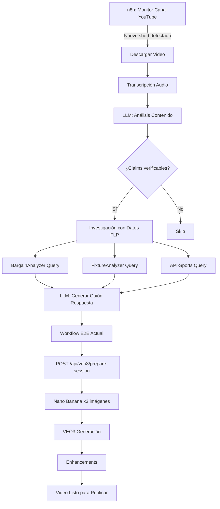

# Feature: Análisis Competencia YouTube → Video Response Automático

**Estado**: 🟡 Pendiente (iniciar mañana tras validar Test #50/51)
**Prioridad**: P0 (después de consolidar workflow E2E actual) **Fecha propuesta
inicio**: 12 Oct 2025 **Canal objetivo**:
[@JoseCarrasco_98/shorts](https://www.youtube.com/@JoseCarrasco_98/shorts)

---

## 📋 Concepto General

Crear un sistema automatizado que:

1. **Analice** videos de competencia (José Carrasco)
2. **Transcriba** el contenido del video
3. **Analice** insights/claims del video
4. **Investigue** con nuestros datos (API-Sports, BargainAnalyzer,
   FixtureAnalyzer)
5. **Genere** video respuesta con el workflow actual (Nano Banana → VEO3)

**Output**: Video viral de Ana respondiendo/ampliando contenido de José Carrasco
con datos reales.

---

## 🎯 Objetivo

**Convertir videos virales de competencia en oportunidades de contenido
propio**, aprovechando:

- Su alcance/engagement (piggyback marketing)
- Nuestros datos superiores (API-Sports real-time)
- Workflow automatizado (Nano Banana + VEO3)

---

## 🏗️ Arquitectura Propuesta


```mermaid
graph TD
    A[n8n: Monitor Canal YouTube] -->|Nuevo short detectado| B[Descargar Video]
    B --> C[Transcripción Audio]
    C --> D[LLM: Análisis Contenido]
    D --> E{¿Claims verificables?}
    E -->|Sí| F[Investigación con Datos FLP]
    E -->|No| Z[Skip]
    F --> G[BargainAnalyzer Query]
    F --> H[FixtureAnalyzer Query]
    F --> I[API-Sports Query]
    G --> J[LLM: Generar Guión Respuesta]
    H --> J
    I --> J
    J --> K[Workflow E2E Actual]
    K --> L[POST /api/veo3/prepare-session]
    L --> M[Nano Banana x3 imágenes]
    M --> N[VEO3 Generación]
    N --> O[Enhancements]
    O --> P[Video Listo para Publicar]
```

---

## 🔧 Stack Tecnológico

### n8n Workflow (Automatización)

- **Trigger**: Webhook o Poll YouTube RSS
- **Nodo 1**: YouTube Video Downloader (yt-dlp)
- **Nodo 2**: Whisper AI (transcripción)
- **Nodo 3**: Claude API (análisis contenido)
- **Nodo 4**: HTTP Request a nuestras APIs
- **Nodo 5**: POST `/api/veo3/prepare-session`
- **Nodo 6**: Polling de status hasta completar

### APIs Necesarias

1. **YouTube Data API v3**
    - Monitoreo canal José Carrasco
    - Detección nuevos shorts
    - Descarga metadata

2. **Whisper AI / AssemblyAI**
    - Transcripción audio → texto
    - Timestamps de claims específicos

3. **Claude API / GPT-4**
    - Análisis de claims/afirmaciones
    - Extracción de jugadores mencionados
    - Identificación de predicciones verificables

4. **Nuestras APIs** (ya existentes)
    - `GET /api/bargains/top` - Chollos actuales
    - `GET /api/bargains/position/:pos` - Por posición
    - `POST /api/bargains/analyze` - Análisis custom
    - `GET /api/fixtures/analyze` - Análisis jornada

5. **VEO3 Workflow** (ya existente)
    - `/api/veo3/prepare-session`
    - `/api/veo3/generate-segment`
    - `/api/veo3/finalize-session`
    - `/api/veo3/add-enhancements`

---

## 📝 Flujo Detallado

### FASE 1: Detección y Descarga (n8n)

```javascript
// n8n Workflow Node 1: YouTube Monitor
// Trigger: Cron (cada 30 min)
const channelURL = 'https://www.youtube.com/@JoseCarrasco_98/shorts';
const latestShort = await YouTubeAPI.getLatestShort(channelURL);

// Check si ya procesado (Supabase registry)
if (!isProcessed(latestShort.id)) {
    downloadVideo(latestShort.url);
}
```

### FASE 2: Transcripción (Whisper AI)

```javascript
// n8n Node 2: Audio Transcription
const transcription = await WhisperAPI.transcribe({
  audioFile: downloadedVideo,
  language: 'es',
  model: 'large-v3'
});

// Output:
{
  text: "Misters, Lewandowski está REGALADO esta jornada...",
  segments: [
    { start: 0.0, end: 3.2, text: "Misters, Lewandowski está REGALADO..." },
    { start: 3.2, end: 7.5, text: "Contra el Getafe en casa marca fijo..." }
  ]
}
```

### FASE 3: Análisis de Contenido (Claude API)

```javascript
// n8n Node 3: Content Analysis
const prompt = `
Analiza la siguiente transcripción de un video de Fantasy La Liga.
Identifica:
1. Jugadores mencionados
2. Claims verificables (ej: "está barato", "marca fijo", "mejor chollo")
3. Predicciones específicas (goles, asistencias, rating)
4. Contexto (jornada, rival, condición)

Transcripción:
${transcription.text}

Devuelve JSON con estructura:
{
  "players": ["Lewandowski"],
  "claims": [
    { "type": "price", "claim": "está regalado", "verifiable": true },
    { "type": "performance", "claim": "marca fijo contra Getafe", "verifiable": true }
  ],
  "predictions": [
    { "player": "Lewandowski", "metric": "goals", "value": "1+" }
  ]
}
`;

const analysis = await ClaudeAPI.analyze(prompt);
```

### FASE 4: Investigación con Datos (Nuestras APIs)

```javascript
// n8n Node 4: Data Research
const playerData = await fetch('/api/bargains/player/Lewandowski');
const fixtureData = await fetch(
    '/api/fixtures/analyze?team=Barcelona&opponent=Getafe'
);

// Verificación de claims:
const verification = {
    price: playerData.price < 10.0, // ¿Es barato?
    valueRatio: playerData.valueRatio > 1.5, // ¿Es chollo real?
    fixture: fixtureData.difficulty < 3, // ¿Rival fácil?
    form: playerData.recentForm.goals > 0.8 // ¿Buena racha?
};
```

### FASE 5: Generación de Guión Respuesta (Claude API)

```javascript
// n8n Node 5: Script Generation
const scriptPrompt = `
Genera un guión de video tipo "respuesta/análisis" para Ana (nuestra analista).

Video original (José Carrasco):
"${transcription.text}"

Datos reales verificados:
- Lewandowski precio: €${playerData.price}M
- Ratio valor: ${playerData.valueRatio}
- Goles últimos 5 partidos: ${playerData.recentForm.goals}
- Dificultad Getafe (casa): ${fixtureData.difficulty}/5

Tono: Viral, datos concretos, sin nombres directos (usar "el delantero polaco").
Estructura: 3 segmentos de 8s (intro/middle/outro).
Longitud diálogo: 40-45 palabras por segmento.

Estilo:
- Intro: Hook conspirativo ("Misters, todos hablan de...")
- Middle: Datos explosivos (precio, ratio, stats reales)
- Outro: CTA urgente ("si no lo fichas ahora...")

Genera JSON con estructura:
{
  "segments": [
    { "role": "intro", "dialogue": "...", "duration": 8 },
    { "role": "middle", "dialogue": "...", "duration": 8 },
    { "role": "outro", "dialogue": "...", "duration": 8 }
  ]
}
`;

const script = await ClaudeAPI.generateScript(scriptPrompt);
```

### FASE 6: Workflow E2E (APIs existentes)

```javascript
// n8n Node 6-10: VEO3 Workflow
// Usa exactamente el mismo flujo que Test #50

// 6. Prepare Session
const session = await fetch('POST /api/veo3/prepare-session', {
    contentType: 'response_video',
    preset: 'viral_response',
    playerData: playerData,
    customScript: script // ← Guión generado en FASE 5
});

// 7-9. Generate 3 segments (con delay 10s)
for (let i = 0; i < 3; i++) {
    await fetch('POST /api/veo3/generate-segment', {
        sessionId: session.sessionId,
        segmentIndex: i
    });
    await sleep(10000); // Delay entre segmentos
}

// 10. Finalize + Enhancements
await fetch('POST /api/veo3/finalize-session', {
    sessionId: session.sessionId
});
await fetch('POST /api/veo3/add-enhancements', {
    sessionId: session.sessionId
});

// Video listo para publicar!
```

---

## 🎬 Ejemplo Caso de Uso

**Input (Video José Carrasco)**:

> "Misters, Lewandowski está REGALADO esta jornada. Contra el Getafe en casa,
> marca fijo. Y cuesta menos de 10 millones, es el mejor chollo de la jornada."

**Output (Video Ana - Nuestro sistema)**:

**Segment 1 (Intro):**

> "Misters, todos hablan del delantero polaco esta semana... y tienen razón.
> Pero os voy a dar los números REALES que nadie está contando."

**Segment 2 (Middle):**

> "El delantero está a nueve millones y medio, ratio uno punto ocho. Ha metido
> gol en cuatro de los últimos cinco partidos, y contra este rival en casa tiene
> un promedio de uno punto tres goles. Los números no mienten, misters."

**Segment 3 (Outro):**

> "¿Qué más queréis? Rating siete punto cinco, rival con defensa rota, y está
> más barato que un suplente del Cádiz. Si no lo ficháis ahora, mañana vale el
> doble."

**Diferencias clave vs competencia:**

- ✅ Datos específicos (€9.5M, ratio 1.8, rating 7.5)
- ✅ Referencias seguras ("el delantero polaco" no "Lewandowski")
- ✅ Contexto estadístico (1.3 goles promedio vs rival)
- ✅ Urgencia + CTA claro

---

## 🛠️ Implementación Técnica

### Nuevas APIs a Crear

**1. Content Analysis Endpoint**

```javascript
// backend/routes/contentAnalysis.js
router.post('/api/content/analyze-youtube', async (req, res) => {
    const { videoUrl, transcription } = req.body;

    // 1. Claude API: Analizar contenido
    const analysis = await claudeAPI.analyzeContent(transcription);

    // 2. Investigar con nuestros datos
    const research = await researchClaims(analysis.players, analysis.claims);

    // 3. Generar guión respuesta
    const script = await generateResponseScript(analysis, research);

    res.json({
        analysis,
        research,
        script,
        videoUrl
    });
});
```

**2. Custom Script Support**

```javascript
// backend/routes/veo3.js - Modificar prepare-session
router.post('/prepare-session', async (req, res) => {
  const { contentType, playerData, customScript } = req.body;

  // Si customScript existe, usar ese en vez de generar uno nuevo
  const script = customScript || await scriptGenerator.generate(...);

  // Continuar workflow normal...
});
```

### n8n Workflow Structure

**Workflow Name**: `youtube-competitor-analyzer-response`

**Nodes**:

1. **Cron Trigger** (cada 30 min)
2. **YouTube API** (get latest shorts)
3. **Supabase Check** (¿ya procesado?)
4. **yt-dlp Download** (descargar video)
5. **Whisper Transcription** (audio → texto)
6. **HTTP Request** → `/api/content/analyze-youtube`
7. **Delay** (10s) - evitar rate limit
8. **HTTP Request** → `/api/veo3/prepare-session`
9. **Loop: Generate Segments** (×3)
10. **HTTP Request** → `/api/veo3/finalize-session`
11. **HTTP Request** → `/api/veo3/add-enhancements`
12. **Supabase Insert** (registro de video procesado)
13. **Notification** (Slack/Email - video listo)

---

## 📊 Métricas de Éxito

**KPIs a trackear**:

- Videos de José Carrasco procesados / día
- Tiempo promedio de generación (target: <15 min)
- Claims verificados correctamente (target: >90%)
- Engagement rate de videos respuesta vs videos normales
- Tasa de conversión (views → clics perfil)

---

## ⚠️ Consideraciones Importantes

### Legal / Ético

- ✅ No copiar contenido directo (solo inspiración/respuesta)
- ✅ Siempre añadir valor (datos propios, análisis profundo)
- ✅ Mencionar "en respuesta a análisis de la comunidad" (sin nombre específico)
- ✅ Fair use: Comentario/crítica/análisis permitido

### Técnico

- ⚠️ YouTube API quota limits (10k requests/día)
- ⚠️ Whisper API costs (~$0.006/min)
- ⚠️ VEO3 costs ($0.90/video)
- ⚠️ Claude API costs (~$0.05/análisis)

**Costo estimado por video**: ~$1.00 total

### Operacional

- Validación humana antes de publicar (al menos inicialmente)
- Sistema de "blacklist" (temas/players a evitar)
- Queue system (evitar sobrecarga VEO3)

---

## 🚀 Plan de Implementación

### Sprint 1: Fundamentos (Días 1-2)

- [ ] Crear endpoint `/api/content/analyze-youtube`
- [ ] Integrar Claude API para análisis
- [ ] Integrar Whisper AI para transcripción
- [ ] Testing con 3-5 videos manualmente

### Sprint 2: Workflow n8n (Días 3-4)

- [ ] Crear workflow n8n completo
- [ ] Configurar YouTube API monitoring
- [ ] Integrar con Supabase (registro videos procesados)
- [ ] Testing E2E con 1 video

### Sprint 3: Refinamiento (Días 5-7)

- [ ] Mejorar prompts de generación de guión
- [ ] Añadir validaciones de calidad
- [ ] Sistema de queue (rate limiting)
- [ ] Dashboard de monitoreo (videos procesados, costs)

### Sprint 4: Producción (Día 8+)

- [ ] Validación con 10 videos reales
- [ ] Ajustes basados en feedback
- [ ] Documentación completa
- [ ] Activar en producción (modo supervisado)

---

## 📚 Referencias

- Canal objetivo: https://www.youtube.com/@JoseCarrasco_98/shorts
- YouTube Data API: https://developers.google.com/youtube/v3
- Whisper AI: https://openai.com/research/whisper
- n8n Docs: https://docs.n8n.io
- Workflow E2E actual: `docs/E2E_VALIDATION_CHECKLIST.md`

---

**Última actualización**: 11 Oct 2025 20:15 **Autor**: Claude Code **Estado**:
🟡 Pendiente aprobación + validación workflow actual
