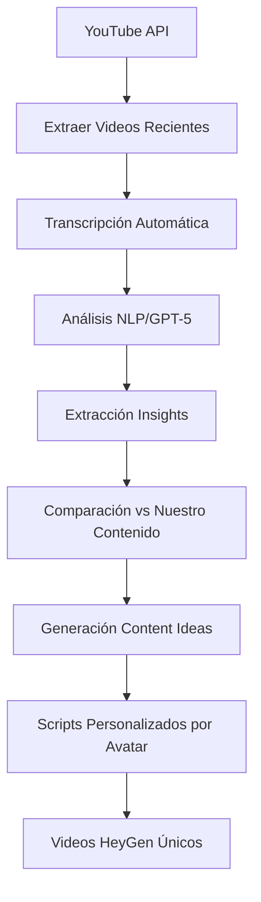

# 🔍 Competitive Intelligence & Content Research

*Sistema de investigación automática para generación de contenido diferenciado*

## 🎯 Objetivo Estratégico

Desarrollar un sistema de **inteligencia competitiva** que analice automáticamente el contenido de otros creators de Fantasy La Liga para:

1. **Identificar tendencias** emergentes en el discourse Fantasy
2. **Detectar gaps de contenido** no cubiertos por la competencia
3. **Generar insights únicos** combinando datos API + análisis competitivo
4. **Crear contenido diferenciado** que se adelante a las tendencias
5. **Optimizar timing** de publicación basado en análisis de engagement

## 🎬 Canales YouTube Target para Análisis

### Tier 1: Creators Principales Fantasy La Liga
```json
{
  "primary_channels": [
    {
      "name": "TheGrefg Fantasy",
      "channel_id": "@TheGrefg",
      "focus": "Fantasy mainstream, influencer approach",
      "frequency": "3-4 videos/semana",
      "analysis_priority": "high"
    },
    {
      "name": "Javi Gómez de Liaño",
      "channel_id": "@javilaliga",
      "focus": "Análisis táctico profesional",
      "frequency": "2-3 videos/semana",
      "analysis_priority": "high"
    },
    {
      "name": "Fantasy Marca",
      "channel_id": "@FantasyMarca",
      "focus": "Tips oficiales, mainstream",
      "frequency": "5-7 videos/semana",
      "analysis_priority": "medium"
    }
  ],
  "secondary_channels": [
    {
      "name": "Mi Fantasy",
      "focus": "Análisis estadístico avanzado",
      "analysis_priority": "medium"
    },
    {
      "name": "Fantasy Pro",
      "focus": "Tips premium, análisis profundo",
      "analysis_priority": "medium"
    },
    {
      "name": "La Liga Fantasy Tips",
      "focus": "Tips rápidos, tendencias",
      "analysis_priority": "low"
    }
  ]
}
```

### Tier 2: Channels Internacionales (Benchmarking)
```json
{
  "international_benchmarks": [
    {
      "name": "Fantasy Premier League (FPL) channels",
      "purpose": "Benchmarking formatos y estrategias de contenido",
      "analysis_focus": "content_format_innovation"
    },
    {
      "name": "ESPN Fantasy Football",
      "purpose": "Análisis de producción profesional",
      "analysis_focus": "production_quality_standards"
    }
  ]
}
```

## 🔧 Sistema Técnico de Análisis

### Pipeline de Investigación Automática



### Componentes Técnicos

#### 1. YouTube Data Extractor
```javascript
// Módulo: youtube-intelligence-extractor.js
class YouTubeIntelligenceExtractor {
  async extractRecentContent(channelIds, timeframe = '7d') {
    // Extraer últimos videos por canal
    // Obtener transcripciones automáticas
    // Metadata: views, engagement, timing
  }

  async getTranscriptions(videoIds) {
    // YouTube Transcript API
    // Fallback: Whisper API para audio
    // Cleaning y formatting
  }
}
```

#### 2. Content Intelligence Analyzer
```javascript
// Módulo: content-intelligence-analyzer.js
class ContentIntelligenceAnalyzer {
  async analyzeCompetitiveContent(transcriptions) {
    // GPT-5 Mini analysis pipeline
    return {
      trending_topics: [...],
      unique_insights: [...],
      content_gaps: [...],
      timing_patterns: {...},
      engagement_triggers: [...]
    };
  }

  async generateCounterContent(analysis, ourData) {
    // Combinar análisis competitivo + datos API-Sports
    // Generar ángulos únicos no cubiertos
    // Scripts diferenciados por avatar
  }
}
```

#### 3. Content Gap Detector
```javascript
// Módulo: content-gap-detector.js
class ContentGapDetector {
  async findUncoveredTopics(competitorAnalysis, ourArchive) {
    // Identificar temas no cubiertos por competencia
    // Cross-reference con datos API disponibles
    // Priorizar por potential engagement
  }

  async suggestTimingStrategy(competitorSchedules) {
    // Análisis de scheduling competitivo
    // Ventanas de oportunidad óptimas
    // Anti-collision strategy
  }
}
```

## 📊 Tipos de Insights a Extraer

### 1. Insights Tácticos
- **Formaciones trending**: Análisis de qué sistemas tácticos mencionan más
- **Jugadores emergentes**: Nombres que empiezan a sonar antes del mainstream
- **Posiciones calientes**: Qué posiciones están generando más debate

### 2. Insights de Mercado Fantasy
- **Precios controvertidos**: Jugadores con opiniones divididas sobre precio
- **Capitanes alternativos**: Opciones no obvias que mencionan
- **Estrategias de diferenciación**: Enfoques únicos que usan otros

### 3. Insights de Engagement
- **Topics que generan debate**: Temas con más comentarios/engagement
- **Formatos que funcionan**: Tipos de video con mejor rendimiento
- **Timing patterns**: Cuándo publican contenido de mayor impacto

### 4. Insights Predictivos
- **Tendencias emergentes**: Temas que empiezan a ganar tracción
- **Jugadores pre-hype**: Nombres antes de que exploten
- **Narrative shifts**: Cambios en el discurso Fantasy general

## 🎭 Integración con Sistema de Avatares

### Asignación por Avatar según Insights

```javascript
const insightToAvatarMapping = {
  // Ana Martínez - Análisis táctico profundo
  tactical_analysis: {
    avatar: 'ana_martinez',
    angle: 'Análisis técnico que otros pasan por alto',
    format: '5min YouTube profundo'
  },

  // Carlos González - Stats y datos
  statistical_insights: {
    avatar: 'carlos_gonzalez',
    angle: 'Números que la competencia no está viendo',
    format: '30s Instagram con infografía'
  },

  // Pablo Teen - Tendencias y viral
  trending_topics: {
    avatar: 'pablo_teen',
    angle: 'Adelantarse a las tendencias antes que otros',
    format: '15s TikTok viral'
  },

  // Lucía Rodríguez - Perspectivas únicas
  unique_perspectives: {
    avatar: 'lucia_rodriguez',
    angle: 'Enfoques no mainstream, diversidad',
    format: '30s diferenciación'
  }
};
```

### Scripts Generados con Competitive Intelligence

```javascript
// Ejemplo de script generado con CI
const ciScript = {
  player: "Nico Williams",
  ci_insight: "Competencia habla de él como extremo, pero está jugando más centrado",
  our_unique_angle: "Analizar como mediapunta en datos posicionales",
  avatar_assigned: "ana_martinez",
  differentiation: "Análisis táctico que nadie más está haciendo"
};
```

## 🔄 Workflow de Investigación Diaria

### Pipeline Automatizado (n8n Workflow)

```json
{
  "competitive_intelligence_workflow": {
    "schedule": "06:00 AM daily",
    "steps": [
      {
        "step": "extract_competitor_content",
        "duration": "15 min",
        "output": "recent_videos_transcripts"
      },
      {
        "step": "analyze_with_gpt5",
        "duration": "10 min",
        "output": "competitive_insights"
      },
      {
        "step": "cross_reference_our_data",
        "duration": "5 min",
        "output": "content_opportunities"
      },
      {
        "step": "generate_unique_scripts",
        "duration": "15 min",
        "output": "differentiated_content"
      },
      {
        "step": "create_heygen_videos",
        "duration": "20 min",
        "output": "unique_avatar_videos"
      }
    ],
    "total_workflow_time": "65 minutes",
    "daily_output": "3-5 unique videos based on competitive intelligence"
  }
}
```

## 💰 Costes y ROI del Sistema CI

### Costes Estimados
```javascript
const ciCosts = {
  youtube_api: "$0.10/day", // 1000 requests
  transcription_whisper: "$0.50/day", // ~50 videos
  gpt5_analysis: "$1.00/day", // Intelligence processing
  storage_insights: "$0.05/day", // Database
  total_daily: "$1.65/day",
  monthly: "$49.50/month"
};
```

### ROI Esperado
- **Diferenciación competitiva**: Contenido único no disponible elsewhere
- **Timing advantage**: Publicar insights antes que competencia
- **Higher engagement**: Contenido más relevante y diferenciado
- **Authority building**: Posicionarse como fuente de análisis avanzado

## 📈 Métricas de Éxito

### KPIs de Competitive Intelligence
- **Time to trend**: ¿Cuánto nos adelantamos a trends?
- **Unique content %**: Porcentaje de contenido no cubierto por competencia
- **Engagement lift**: Mejora en engagement vs contenido base
- **Authority metrics**: Menciones/references de otros creators

### Dashboard de CI
- **Competitor tracking**: Activity de principales competitors
- **Trend detection**: Trending topics emergentes
- **Content gap analysis**: Oportunidades no cubiertas
- **Performance comparison**: Nuestro rendimiento vs competencia

## 🎯 Fases de Implementación

### Fase 1: Foundation (Mes 1)
- [ ] YouTube API integration
- [ ] Basic transcription system
- [ ] GPT-5 analysis pipeline
- [ ] Content gap detection

### Fase 2: Intelligence (Mes 2)
- [ ] Advanced competitor profiling
- [ ] Trend prediction algorithms
- [ ] Automated insight extraction
- [ ] Avatar content assignment

### Fase 3: Automation (Mes 3)
- [ ] Full n8n workflow integration
- [ ] Real-time competitor monitoring
- [ ] Automated content generation
- [ ] Performance optimization

### Fase 4: Advanced (Mes 4+)
- [ ] Predictive content modeling
- [ ] Cross-platform analysis (Twitter, Instagram)
- [ ] International benchmarking
- [ ] AI-powered timing optimization

## 🔒 Consideraciones Éticas y Legales

### Guidelines Éticos
- **No copia directa**: Inspiración e insights, nunca copia literal
- **Attribution cuando apropiado**: Referencias a insights públicos
- **Value creation**: Siempre añadir valor único a los insights
- **Transparency**: Ser transparentes sobre fuentes cuando relevante

### Compliance Legal
- **YouTube ToS compliance**: Uso apropiado de API y contenido público
- **Copyright respect**: No uso de audio/video ajeno
- **Data protection**: Almacenamiento seguro de insights extraídos

## 🚀 Valor Estratégico Único

Este sistema de **Competitive Intelligence** convierte nuestro proyecto de:

❌ **Otro canal Fantasy más**
✅ **El canal Fantasy más informado y diferenciado**

**Competitive Advantage**: Seremos los **únicos** con:
- Análisis automático de toda la competencia 24/7
- Insights únicos generados por AI + competitive data
- Timing perfecto anticipándose a trends
- Contenido diferenciado por design, no por casualidad

---

*Este documento establece la roadmap para convertir Fantasy-HeyGen-Lab en el sistema de análisis competitivo más avanzado del ecosistema Fantasy La Liga.*

**Status**: 📋 **DOCUMENTADO - READY FOR PHASE PLANNING**
**Next Step**: Priorizar en roadmap de desarrollo post-validación HeyGen básica